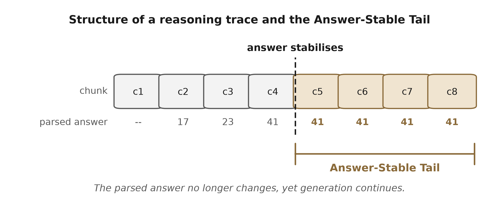
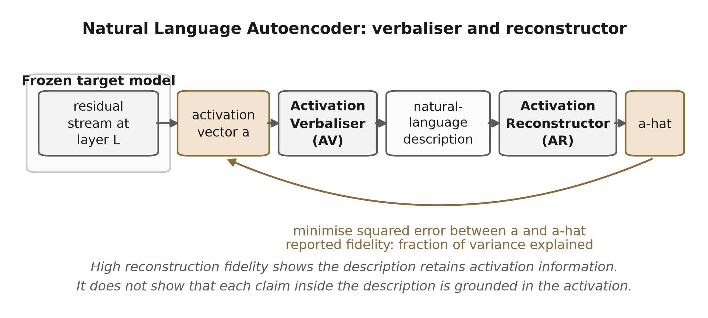
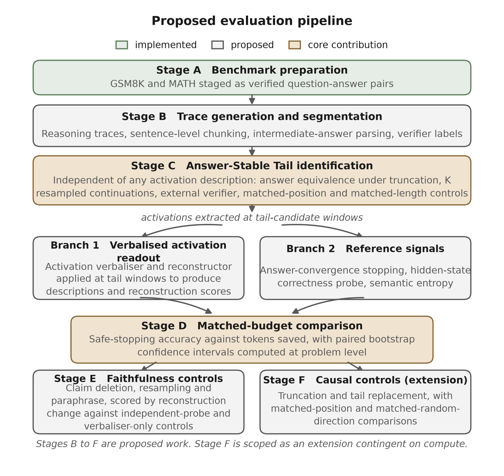
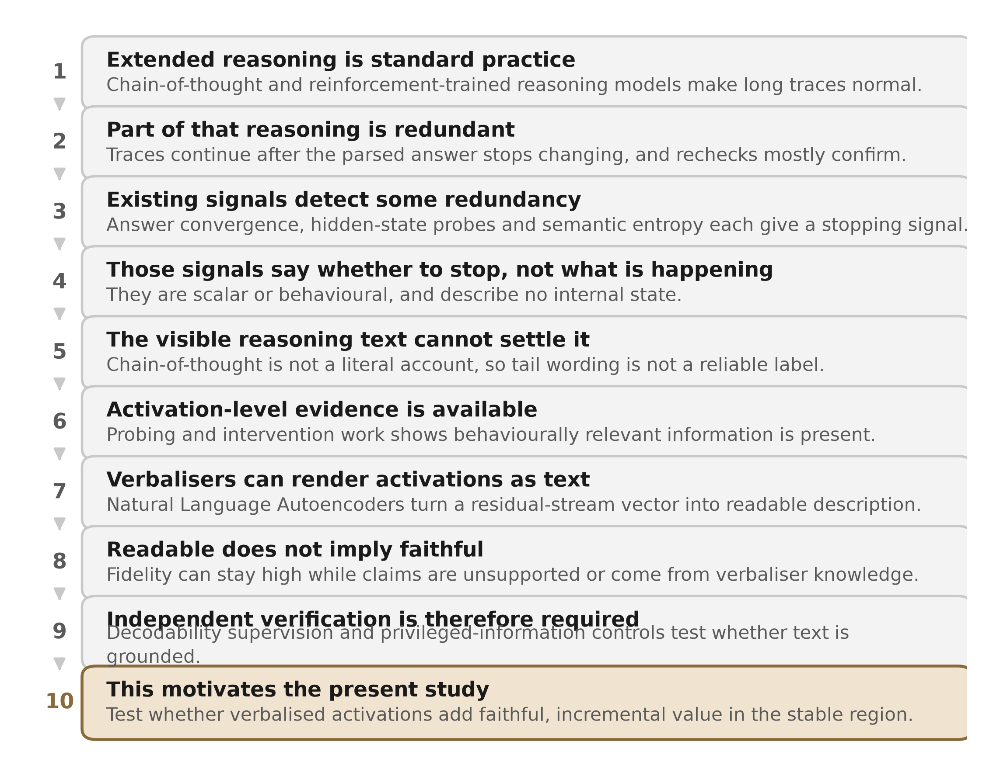

# Natural Language Autoencoders for Redundancy Diagnostics

**Project Review I: Introduction and Literature Review**

---

**Student name:** _______________________

**Registration number:** _______________________

**Programme / Department:** _______________________

**Supervisor:** _______________________

**Date of submission:** _______________________

---

## Abstract of Scope

This review establishes the background, problem statement and literature foundation for a study of redundant reasoning in large language models. The study asks whether Natural Language Autoencoders can provide faithful and useful semantic information about the region of a reasoning trace that follows answer stabilisation, beyond what existing behavioural and uncertainty-based signals already supply. Chapter 1 sets out the background, the research problem and the aim with its supporting objectives. Chapter 2 reviews the relevant literature across nine themes, synthesises the research argument, and identifies the research gap. All experimental work described in this document is proposed. The current implementation covers benchmark preparation only, and no in-house experimental result is reported or implied anywhere in this review.

---

## Table of Contents

**Chapter 1: Introduction**
- 1.1 Background of the Study
- 1.2 Problem Statement
- 1.3 Aim and Objectives

**Chapter 2: Literature Review**
- 2.1 Review of Existing Work
  - 2.1.1 Reasoning Models and Inference-Time Computation
  - 2.1.2 Redundant Reasoning, Overthinking, and Self-Verification
  - 2.1.3 Answer Convergence and Early Termination
  - 2.1.4 Uncertainty-Based Diagnostics of Reasoning
  - 2.1.5 Hidden-State and Activation-Based Diagnostics
  - 2.1.6 Faithfulness of Chain-of-Thought Explanations
  - 2.1.7 Mechanistic Interpretability of Residual-Stream Activations
  - 2.1.8 Natural Language Autoencoders
  - 2.1.9 Faithfulness of Natural-Language Activation Explanations
  - 2.1.10 Synthesis of the Reviewed Literature
- 2.2 Research Gap Identification

**Comparative Literature Tables**
- Table A: Reasoning, Overthinking, and Early-Termination Literature
- Table B: Activation-Explanation and Faithfulness Literature

**References**

**List of Figures**
- Figure 1.1: Structure of a reasoning trace and the Answer-Stable Tail
- Figure 1.2: Natural Language Autoencoder, verbaliser and reconstructor
- Figure 1.3: Proposed evaluation pipeline
- Figure 2.1: How the reviewed literature converges on the research problem

---

# CHAPTER 1: INTRODUCTION

## 1.1 Background of the Study

Large language models are now the dominant computational substrate for multi-step reasoning across arithmetic, mathematics, programming and expert question answering. The interface through which these systems reason is chain-of-thought prompting, in which a model is induced to emit an explicit sequence of intermediate steps before producing a final answer [1]. Chain-of-thought prompting improves accuracy on multi-step problems, and the pattern has been extended by reasoning-specialised models trained with reinforcement learning on verifiable rewards, which expand the range of tasks solvable by generation alone [2]. Two benchmarks define the evaluation substrate used throughout this study. GSM8K contains grade-school arithmetic word problems with gold-standard final-answer labels [3]. MATH contains 12,500 competition problems across seven subjects, including algebra, counting and probability, geometry, intermediate algebra, number theory, pre-algebra and precalculus, and therefore supports subject-level stratification [4]. Both benchmarks allow a parsed final answer to be checked programmatically, which makes them suitable for the behavioural measurements this study requires.

The capability gains of reasoning-specialised models have been accompanied by a documented inefficiency. Reasoning traces frequently continue after the model's answer has effectively settled, so that further tokens produce no change in the predicted answer. Several recent studies have characterised this behaviour independently. Liu and Wang segmented chain-of-thought traces into sentence-level chunks, extracted an intermediate answer at each boundary, and showed across five open-weight models and five benchmarks that stopping once intermediate answers agree preserves accuracy while reducing generated tokens, with a reduction of more than forty per cent on one benchmark alongside a small accuracy gain [5]. Zhang et al. showed that correctness information is linearly decodable from the intermediate hidden states of reasoning models and that a probe-guided early exit reduced inference tokens by twenty-four per cent without compromising performance [6]. Caldarella et al. introduced a first-correct-prefix evaluation in which the earliest point where the parsed answer matches the verifier label separates a potentially harmless suffix, termed verbose overthinking, from a suffix that causes an already-correct trajectory to be abandoned, termed harmful overthinking; stopping at the first correct prefix improved accuracy by up to twenty-one per cent on the tasks examined [7]. Zhai et al. operationalised redundancy as the largest trailing fraction of a reasoning trace that can be truncated while the final answer remains correct, and reported substantial redundancy on frontier models [8]. The post-answer region of a reasoning trace is therefore an empirically measurable regularity rather than an anecdotal observation.

Figure 1.1 illustrates the construct at the centre of this study. A reasoning trace is divided into sentence-level chunks, an intermediate answer is parsed at each chunk boundary, and the point at which that parsed answer stops changing marks the beginning of what this study calls the Answer-Stable Tail.

**Figure 1.1.** Structure of a reasoning trace and the Answer-Stable Tail. The parsed intermediate answer stabilises at a chunk boundary, yet generation continues. The shaded region is the candidate tail that this study seeks to characterise.

The question these behavioural measurements leave open concerns what the tail represents at a representational level. One widely entertained hypothesis is that the model is performing internal self-verification, that is, a redundant check on an answer it has already computed. The hypothesis is supported in part by the observation that reflective recheck behaviour occupies a non-trivial share of reasoning tokens and is predominantly confirmatory rather than corrective [9]. It is attractive because it links a scientific claim about internal computation to a practical control: if a checking phase can be identified, it can be truncated at matched accuracy.

Natural Language Autoencoders offer a mechanism for testing this hypothesis. Fraser-Taliente et al. jointly train an activation verbaliser, which samples free-form text from a residual-stream activation, and an activation reconstructor, which maps that text back to a vector [10]. The training objective minimises the expected squared reconstruction error between the original activation and the reconstructor output, with a Kullback-Leibler regulariser, and the verbaliser is warm-started from context-summary pairs before joint policy optimisation. Reconstruction fidelity is reported as fraction of variance explained, with the autoencoders evaluated in that work reaching 0.6 to 0.8. The authors note in their limitations that inference requires generating several hundred tokens per activation. Alongside the report, eight checkpoints were released across four open model families, including Qwen2.5-7B-Instruct at layer 20, Gemma-3-12B-IT at layer 32, Gemma-3-27B-IT at layer 41 and Llama-3.3-70B-Instruct at layer 53 [10]. Because training is coupled to a specific model and layer, the extraction site, vector normalisation, injection scaling, tokeniser and chat template must match the released checkpoint, so these autoencoders are not transferable across models. Figure 1.2 summarises the mechanism.

**Figure 1.2.** Natural Language Autoencoder. The verbaliser converts a residual-stream activation into a natural-language description, and the reconstructor maps that description back to a vector. The training objective minimises the error between the original and reconstructed vectors. High reconstruction fidelity shows that the description retains activation information, but it does not show that each individual claim inside the description is grounded in the activation.

Three constraints prevent a direct application of this technique to the post-answer region.

The first constraint is that reconstruction fidelity is not the same property as claim-level faithfulness. Dingeto introduced the RECAP framework and showed in controlled settings that a verbalised description can preserve a substantial share of activation variance while individual claims within it are not themselves reconstruction-dependent, so that flipping one claim to a false alternative often leaves the reconstruction unchanged and therefore unpenalised [11]. RECAP responds to this by co-training the target model with linear decodability heads that preserve pre-specified facts, so that designated variables remain auditable against a fresh probe; under that procedure an independent probe scored true claims above false ones with an AUC of 0.96, compared with 0.82 without it [11]. This procedure requires training the target model and therefore does not retrospectively validate free-form descriptions produced by already-released checkpoints. Independent work reinforces this conclusion from different directions. Li et al. evaluated prominent activation-verbalisation methods and found that strong benchmark performance can be achieved without access to target-model internals, so that reported explanations may reflect the verbaliser's own parametric knowledge rather than the target activations [12]. Lek et al. documented that standard training can yield descriptions that are increasingly predictive of model behaviour while also introducing increasingly unsupported detail, and proposed a diffusion-likelihood training objective together with a standardised evaluation framework for unstructured explanations [13]. Zhao et al. proposed a preference-optimisation framework that reduces hallucination in activation verbalisations, reporting improvements of up to 17.1 and 9.3 percentage points on gist and detail recovery respectively over baseline approaches [14]. Taken together, these results establish that the faithfulness of free-form verbalised descriptions is an open problem rather than a settled property.

The second constraint is that textual reports produced by language models are not literal accounts of the underlying computation. Turpin et al. showed that chain-of-thought text can be systematically influenced by prompt features that the model never acknowledges [15]. Lanham et al. developed a framework in which chain-of-thought tokens are deleted, resampled or paraphrased, and reported that models vary widely in how strongly they condition on the chain of thought, with a substantial share of content removable in many settings without changing the final answer [16]. Chen et al. examined reasoning models trained with reinforcement learning on verifiable rewards and found that chain-of-thought frequently omits hints that demonstrably influenced the answer [17]. A surface statement such as "let me check this" within a reasoning tail therefore cannot be treated as a reliable label for an internal verification state.

The third constraint is that intrinsic self-correction in reasoning models is not reliably useful. Huang et al. showed in controlled experiments that repeated self-correction without external feedback often fails to improve, and sometimes degrades, reasoning accuracy, and that several previously reported gains did not survive tighter controls [18]. A tail that resembles verification cannot therefore be presumed beneficial.

Any causal claim about an internal state operating in the tail must also respect established methodological standards. Zhang and Nanda examined how choices of metric, corruption, restoration site and normalisation materially change the interpretation of activation-patching experiments, and recommended matched-random-direction controls, dose-response curves and tests across multiple sites before an intervention is read as mechanistic evidence [19]; path-patching foundations for localising behaviour to specific residual-stream paths are due to Goldowsky-Dill et al. [20]. Semantic entropy, which clusters sampled answers by meaning and computes entropy over those clusters, is the reference uncertainty signal for free-form generation and outperforms lexical entropy and several confidence baselines on confabulation detection [21]. It is a strong comparator, but it measures uncertainty about the outcome rather than the character of the tail.

Relevant components needed to investigate the tail therefore exist separately: released autoencoder checkpoints, behavioural and representational stopping signals, formal taxonomies of overthinking, and an established methodology for causal intervention on residual states. Within the literature reviewed for this study, no work was identified that combines them into an evaluation capable of deciding whether a verbalised activation readout adds diagnostic value over the cheaper signals, or whether a tail that appears to perform verification corresponds to a causally meaningful internal state as distinct from answer stability itself. This study is directed at that question.

## 1.2 Problem Statement

Reasoning models produce a region of generation after their answer has become behaviourally stable, and the literature establishes this as an empirically measurable regularity [5], [7], [8]. The literature also establishes the principal low-cost signals available for deciding when to stop: agreement between intermediate answers across chunks [5], hidden-state correctness probes [6] and meaning-level semantic entropy [21]. Natural-language readouts of residual activations are technically available through released autoencoder checkpoints [10]. These elements have not, however, been combined into an evaluation that can determine whether such readouts carry stopping-relevant information beyond what the cheaper signals already provide, or whether any detected tail corresponds to a causally meaningful internal state rather than a textual regularity.

Four specific limitations persist across the reviewed literature.

**L1. The post-answer region lacks an operational definition that is independent of activation descriptions.** The first-correct-prefix construction depends on an answer parser and can mark a coincidentally correct early answer as a correct prefix [7]. The answer-agreement criterion is a behavioural proxy, and Mo et al. show that consensus-based stopping can halt a trajectory before the model recovers a missed constraint: at a rule still saving thirty-two per cent of tokens, one stop in nine fired on an answer that the trajectory later abandoned, and the problematic share fell to about seven per cent only when the saving had dropped to eight per cent [22]. Neither approach pairs its stopping decision with resampled-continuation controls that would test whether the parsed answer is stable across independent completions from the same prefix.

**L2. Verbalised activation readouts have not been compared against the cheaper signals on stopping.** Fraser-Taliente et al. report reconstruction fidelity and audit case studies on activations in general, but do not evaluate verbalised readouts against semantic entropy [21], hidden-state correctness probes [6] or answer-convergence stopping [5] on the task of terminating a reasoning trace at matched compute budgets [10]. An informal community analysis has applied released autoencoders to GSM8K, but it is scoped to reconstruction quality on correct as against incorrect activations rather than to stopping [23].

**L3. Verbalised descriptions have not been audited at claim level on reasoning tails.** The RECAP challenge [11], the privileged-information challenge [12] and the confabulation analysis of Lek et al. [13] each show that such an audit is methodologically demanding and that free-form descriptions can contain unsupported content. The deletion, resampling and paraphrase template developed for chain-of-thought text [16] has not been applied to verbalised activation descriptions in a reasoning-tail setting.

**L4. The putative verification tail has no causal validation with matched controls.** Early-exit studies report accuracy against token trade-offs [5], [6], [7] but do not include tail-replacement or matched-control activation-patching experiments following the methodology of Zhang and Nanda [19].

The practical consequence is that stopping policies are currently deployed either on heuristic length cut-offs or on behavioural proxies whose relationship to internal state is unknown. The scientific consequence is that interpretability claims of the form "the model is internally verifying its answer" risk being asserted on the basis of textual appearance, without faithfulness or causal evidence.

## 1.3 Aim and Objectives

**Aim.** To investigate whether Natural Language Autoencoders can provide faithful and useful semantic information about redundant reasoning in the post-answer region of large language model reasoning, beyond what existing behavioural and uncertainty-based signals supply, and to evaluate that information under appropriate faithfulness and causal controls.

**Primary research question.** On GSM8K and MATH, does a verbalised readout of residual-stream activations provide incremental diagnostic value for safe stopping over semantic entropy, hidden-state correctness probes and answer-convergence stopping, and does that value survive faithfulness and causal controls?

**Supporting research questions.**

**RQ1.** Can the Answer-Stable Tail be identified by a criterion that is independent of any activation description and that passes resampled-continuation and external-verifier controls?

**RQ2.** Under claim-level audit, what share of verbalised descriptions generated on tail windows are reconstruction-dependent, when assessed with independent-probe and verbaliser-only controls of the kind motivated by [11] and [12]?

**RQ3.** Under matched-control interventions, do tail-window states carry a direction whose ablation selectively changes verification-like behaviour without changing final answers?

**Objectives.** The study is organised around six objectives. Each addresses one of the limitations L1 to L4 or the reporting requirement. The proposed pipeline is shown in Figure 1.3.

**Figure 1.3.** Proposed evaluation pipeline. Stage A is implemented. Stages B to F are proposed work, and Stage F is scoped as an extension contingent on available compute.

**O1.** Define the Answer-Stable Tail operationally without reference to any activation description, using chunk-level answer equivalence under truncation at a candidate boundary, K independently sampled continuations checked against the external mathematical verifier, and matched-position and matched-length controls on GSM8K and MATH. *Addresses L1.*

**O2.** Implement a reproducible pipeline that loads the released Qwen2.5-7B-Instruct layer-20 autoencoder checkpoint and emits verbalised descriptions together with reconstructed vectors at tail-candidate windows, with versioned prompts, a fixed decoding configuration, verifier integration and activation-cache hashes. *Addresses L2 at the implementation level.*

**O3.** Measure the incremental value of the verbalised readout over semantic entropy [21], a hidden-state correctness probe [6] and answer-convergence stopping [5], on paired safe-stopping accuracy and tokens saved at matched compute budgets, with paired bootstrap confidence intervals computed at problem level. *Addresses L2 at the evaluation level.*

**O4.** Audit a stratified sample of verbalised descriptions generated on tail windows using the deletion, resampling and paraphrase template of [16], scored by change in reconstruction and cross-checked against an independent-probe control and a verbaliser-only control. This is a RECAP-inspired evaluation that adopts the principle of independent verification established in [11]; it does not reproduce the RECAP training procedure, which requires co-training the target model. *Addresses L3.*

**O5.** Run a causal-validation sequence consisting of truncation, tail replacement with neutral filler, and matched-position and matched-random-direction comparisons, following the methodological recommendations of [19] with path-patching precedent from [20], to test whether removing or altering the tail changes verified behaviour in a direction-specific manner. *Addresses L4.*

**O6.** Release the labelled tail corpus and the evaluation harness together with a pre-registered analysis plan, reporting an inter-rater reliability coefficient for all semantic labels, so that later work on target-model co-trained decodability [11], additional model families or non-mathematical tasks can be run against a stable reference. *Reporting.*

**Scope and current implementation status.** This review is prepared at the proposal stage. Of the work described above, only benchmark preparation is implemented: a download script stages GSM8K in full and two of the seven MATH subjects, namely algebra and counting and probability. No model inference, activation extraction, autoencoder invocation, baseline signal, verifier integration, intervention code, annotation protocol or evaluation harness has been built at the time of writing, and no experimental result is reported anywhere in this document. Objectives O1 to O4 constitute the core of the study and are judged achievable within the project period on a single mid-range accelerator, since the Qwen2.5-7B target model and its layer-20 autoencoder are the smallest released pairing. Objective O5 is scoped as an extension: truncation and tail replacement are achievable, whereas a full dose-response patching sweep across multiple sites is contingent on available compute and will be reported as a partial result if that budget is not met. Within objective O6, the blinded multi-rater annotation depends on recruiting a second trained annotator; if that is not achieved, the study will report single-rater labels and state the absence of a reliability coefficient explicitly rather than omitting the limitation. A plausible outcome of the study is that the cheaper signals match or exceed the verbalised readout at matched budget. That outcome is scientifically useful, and the protocol is designed to report it with the same weight as a positive result; it would recast verbalised activation readouts as a semantic interface over equivalent detectability rather than as a new detector.

**Positioning of the contribution.** This study does not propose a new interpretability method, and it does not claim that natural-language readouts of activations are new as a technique, since the verbaliser and reconstructor architecture and the released checkpoints are due to Fraser-Taliente et al. [10]. The intended contribution is methodological and evaluative: an integrated protocol combining an independent tail definition, comparison against established signals, blinded semantic annotation, claim-level faithfulness auditing and matched-control interventions, applied to a question that the reviewed literature does not resolve.

---

# CHAPTER 2: LITERATURE REVIEW

## 2.1 Review of Existing Work

The literature bearing on this study sits at the intersection of two bodies of research that have developed largely independently: reasoning efficiency, redundancy and faithfulness on one side, and mechanistic interpretability of model activations on the other. This review organises existing work into nine themes and closes with a synthesis that positions the proposed study with respect to them.

### 2.1.1 Reasoning Models and Inference-Time Computation

The dominant interface through which contemporary language models reason is chain-of-thought prompting, in which the model emits intermediate steps before producing a final answer [1]. This raises accuracy on multi-step problems and has become both the computational substrate and the candidate interpretability target for subsequent work. Reasoning-specialised models trained with reinforcement learning on verifiable rewards rely on long chains of thought as a working-memory surface, and DeepSeek-AI reported that reinforcement learning over verifier-based rewards is sufficient to elicit extended reasoning without supervised fine-tuning on reasoning traces [2]. The two mathematical benchmarks used most often to study this behaviour, GSM8K [3] and MATH [4], both support programmatic answer checking, which is what makes the behavioural measurements in this area reproducible.

### 2.1.2 Redundant Reasoning, Overthinking, and Self-Verification

A substantial body of work documents that long reasoning traces contain redundant computation. Caldarella et al. proposed the first-correct-prefix formalism to separate verbose from harmful overthinking, and reported that stopping at the first correct prefix improves accuracy by up to twenty-one per cent and reduces verbose overthinking by up to fifty per cent; their analysis began on multimodal benchmarks and was then shown to generalise to language-only reasoning benchmarks [7]. Zhai et al. operationalised redundancy as the largest fraction of trailing reasoning steps that can be truncated while final-answer correctness is preserved, and found substantial redundancy across frontier models; the measurement is purely behavioural and does not involve activation-level analysis [8]. Long et al. focused specifically on self-verification and documented that reflective recheck steps are overwhelmingly confirmatory rather than corrective, rarely identifying errors or altering reasoning outcomes; they proposed a test-time framework that retrieves past verification outcomes from an offline experience pool to judge whether a candidate recheck is likely unnecessary [9]. Separately, controlled negative results on intrinsic self-correction show that without external feedback, repeated correction loops often fail to improve and sometimes degrade accuracy [18]. This theme therefore supports two conclusions that constrain the present study: redundant reasoning is a measurable regularity, and a tail that resembles verification should not be assumed beneficial on the basis of its appearance.

### 2.1.3 Answer Convergence and Early Termination

A complementary line of work converts the behavioural regularity into stopping policies. Liu and Wang segmented traces into sentence-level chunks, parsed an intermediate answer at each boundary, and showed that stopping once consecutive intermediate answers agree reduces generated tokens with little or no accuracy drop across five open-weight models and five benchmarks, reporting a reduction of more than forty per cent on NaturalQuestions alongside an accuracy improvement; they also trained a supervised stopping policy on internal activations, which further improves the trade-off [5]. Mo et al. stress-tested this family of policies and showed that wider agreement windows do not close the gap between a stable answer and a finished trajectory: at a rule saving thirty-two per cent of tokens, one stop in nine fired on an answer the trajectory later abandoned, and although the problematic share levels off near seven per cent, by that point the saving has fallen to eight per cent [22]. Agreement is therefore necessary but not sufficient for safe stopping, which provides independent justification for pairing any candidate tail criterion with resampled-continuation controls. Related work on end-of-reasoning tokens shows that even injecting an explicit end-of-thinking marker does not reliably halt generation, since answering-phase text can continue before the model regenerates another such marker [24].

### 2.1.4 Uncertainty-Based Diagnostics of Reasoning

Meaning-level uncertainty quantification supplies a complementary signal for deciding when a trace can be stopped. Farquhar et al. introduced semantic entropy, in which several generations are sampled, clustered by semantic equivalence, and entropy is computed over the resulting meaning clusters rather than over token sequences [21]. The signal outperforms lexical entropy and several confidence baselines on confabulation detection across the models and tasks considered, and has become the reference meaning-level uncertainty baseline. For the reasoning-tail setting, semantic entropy measures uncertainty about the outcome rather than the character of the tail: it addresses how uncertain the final answer is, not what the continued generation is doing. It is therefore a comparator that any proposed diagnostic must be measured against, rather than a competing diagnostic in its own right.

### 2.1.5 Hidden-State and Activation-Based Diagnostics

Hidden-state probes provide a representational complement to behavioural stopping signals. Zhang et al. segmented long chains of thought into chunks containing intermediate answers and trained a binary classifier to predict answer correctness from hidden states at the answer positions, reporting that the probe verifies intermediate answers with high accuracy and produces well-calibrated scores, and that probe-guided exit reduced inference tokens by twenty-four per cent without compromising performance [6]. They also observed look-ahead behaviour, in which correctness is predictable before the intermediate answer is fully articulated, and found that performance degraded substantially when the same method was applied to short chain-of-thought models, which suggests the encoded correctness information is acquired during long chain-of-thought training. Two caveats apply. First, decodability demonstrates that information is available in the activation, not that the model causally uses it, and converting a decodable direction into a mechanistic claim requires intervention evidence with matched controls [19]. Second, the probe is a scalar readout and therefore describes nothing further about the state that may be behaviourally relevant.

### 2.1.6 Faithfulness of Chain-of-Thought Explanations

Whether chain-of-thought text can be read as a literal account of internal computation has been examined directly, with consistently sceptical conclusions. Turpin et al. perturbed prompt features that would change a model's answer if detected, and measured whether the explanation acknowledged the influence; models systematically used biasing features without mentioning them, which rules out treating the text as a faithful log of the process [15]. Lanham et al. proposed a complementary framework in which tokens are deleted, resampled or paraphrased and the sensitivity of the final answer serves as a proxy for faithfulness, reporting large variation across tasks in how strongly models condition on the chain of thought, and observing that larger and more capable models produced less faithful reasoning on most tasks studied [16]. Chen et al. extended this to reasoning models trained with verifiable rewards and reported that chains of thought frequently fail to disclose hints that influenced the answer, concluding that monitoring the visible reasoning is useful but not sufficient to rule out unintended behaviour [17]. For the present study the consequence is direct: the surface text of a tail cannot serve as a ground-truth label for whether the model is verifying its answer, so tail-type labels must come from blinded annotation rather than keyword matching.

### 2.1.7 Mechanistic Interpretability of Residual-Stream Activations

Causal tracing and activation patching are the reference tools for intervention-based claims about internal state. Meng et al. established the pattern for localising factual associations [25]. Goldowsky-Dill et al. introduced path patching to localise behaviour to specific residual-stream paths [20]. Zhang and Nanda examined how choices of evaluation metric, corruption method, restoration site and normalisation change the conclusions drawn from patching experiments, showing that varying these hyperparameters can lead to divergent interpretability results, and recommending matched-random-direction controls, matched-position controls and dose-response curves across multiple sites [19]. Sparse autoencoders offer a complementary method for isolating interpretable directions in the residual stream and have been scaled on production models with explicit analysis of monosemantic feature structure [26]. These methods supply the standards that any causal claim about a tail direction must meet. They do not themselves produce natural-language descriptions of residual states, which is the role of the next theme.

### 2.1.8 Natural Language Autoencoders

Fraser-Taliente et al. introduced Natural Language Autoencoders, which train a verbaliser that samples text from a residual-stream state and a reconstructor that maps text back to a vector [10]. Joint training minimises expected squared reconstruction error with a Kullback-Leibler regulariser, with the verbaliser warm-started from context-summary pairs and then updated by policy optimisation. The verbaliser injects the activation into a special-token embedding, and the reconstructor is a truncated backbone followed by a vector head. Reconstruction fidelity is reported as fraction of variance explained, growing roughly linearly in the logarithm of training steps, with the autoencoders evaluated in that work reaching 0.6 to 0.8. Case studies on Claude Opus 4.6, Haiku 4.5 and Haiku 3.5 produced audit leads corroborated by training-data inspection, sparse-autoencoder evidence, attribution or steering. The authors are explicit about the limits of the method: descriptions can confabulate, audits are corroborated for selected cases rather than for all descriptions, inference requires generating several hundred tokens per activation, each verbaliser and reconstructor pair is coupled to a specific model and layer, and failure modes exist in which the two components agree on an internal protocol that does not correspond to external language. The method is therefore best understood as an open-ended hypothesis generator rather than a semantic ground-truth instrument. The source is an institutional project report rather than a peer-reviewed publication, although training code and eight checkpoints across four open model families were released alongside it. An informal community analysis has applied these released checkpoints to GSM8K and observed that reconstruction fidelity is lower for activations leading to incorrect answers than for those leading to correct ones [23]. That analysis is not peer-reviewed, does not evaluate stopping, and does not propose or test an operational definition of the post-answer region.

### 2.1.9 Faithfulness of Natural-Language Activation Explanations

The faithfulness of free-form verbalised descriptions has been challenged directly and from several directions. Dingeto observed that scoring an explanation by reconstruction is structurally insensitive to individual false claims, since flipping one claim to a false alternative often leaves the reconstruction unchanged and therefore unpenalised [11]. The proposed response, RECAP, co-trains the target model with linear heads on external targets so that designated content remains decodable and auditable against a fresh probe; under that procedure an independent probe scored the verbaliser's true claims above its false ones with an AUC of 0.96, against 0.82 without it. RECAP therefore strengthens the evidential basis for a pre-specified readout, but it does not retrospectively validate arbitrary free-form descriptions produced by released checkpoints, and it offers no mechanism for target models that have not been co-trained in this way.

A convergent and independent challenge comes from Li et al., who reproduced prominent verbalisation methods and ablated access to target-model internals, finding that one can perform well on the standard benchmarks without such access and that verbalisations often reflect the parametric knowledge of the verbaliser rather than the knowledge of the target model whose activations are nominally being decoded [12]. They conclude that targeted benchmarks and experimental controls are needed before verbalisation is read as insight into a target model. Lek et al. analysed the same tension from the training side, documenting that explanations become more useful for predicting model behaviour while also introducing more unsupported detail, and proposed modelling the distribution of activations compatible with an explanation through a diffusion likelihood bound rather than optimising single-point reconstruction, together with a standardised evaluation framework measuring recoverable information, contextual support for claims and writing quality [13]. Zhao et al. proposed a two-stage preference-optimisation framework that reconstructs source text from hidden activations and then evaluates it with a frozen question-answering model, with rewards balancing semantic recoverability against lexical fidelity, reporting improvements of up to 17.1 and 9.3 percentage points on gist and detail recovery respectively [14]. Of these four works, one is published at a peer-reviewed venue [12] and three are preprints at the time of this review [11], [13], [14]. Together they establish that free-form verbalised output is currently an unreliable surface and that any downstream use requires a claim-level audit together with a control for verbaliser knowledge.

Frameworks for self-correction that depend on external feedback occupy an adjacent area and show that gains over single-pass reasoning are available when a reliable external signal is present [27]. The relevance here is that the post-answer region in standard reasoning models generally has no such signal, which further limits how much productive computation the region is likely to represent.

### 2.1.10 Synthesis of the Reviewed Literature

The reviewed literature converges on the research problem across three analytical steps, set out in sequence in Figure 2.1.

**Figure 2.1.** How the reviewed literature converges on the research problem. Each step is supported by the work reviewed in the corresponding theme above.

**Step 1: the post-answer regularity is established.** Reasoning models produce extended traces that frequently continue after the answer has stabilised. This is supported independently by segmentation and agreement evidence [5], first-correct-prefix evidence [7], redundancy-fraction measurement [8], and the finding that reflective rechecks are predominantly confirmatory [9].

**Step 2: existing stopping signals do not characterise internal state.** Behavioural proxies are not watertight. Consensus stopping leaves a residual rate of premature stops [22], injecting an end-of-thinking marker does not reliably halt generation [24], and intrinsic self-correction loops can degrade accuracy [18]. Hidden-state probes show that correctness is encoded in activations [6], but decodability is availability rather than causal use [19]. Semantic entropy measures outcome uncertainty rather than tail character [21]. Across the reviewed work, no single behavioural or scalar signal both resolves what a post-answer region is doing and comes with activation-level causal evidence.

**Step 3: verbalised activation readouts are available but not audited for this setting.** Natural Language Autoencoders provide a mechanism for free-form, activation-conditioned description at scale [10]. Reconstruction fidelity does not guarantee claim-level faithfulness [11], verbaliser knowledge can account for apparent performance without privileged access to the target [12], and alternative training objectives are being developed specifically to curb unsupported detail [13], [14]. The combination of a verbalised readout on reasoning tails with a claim-level audit, a comparison against established signals and matched-control intervention has not been reported in the peer-reviewed literature reviewed here, and the single informal analysis that applies these autoencoders to GSM8K is scoped to reconstruction quality rather than stopping or causal evidence [23].

Three distinctions follow from this synthesis and shape the design of the proposed study. First, answer stability and causal redundancy are different properties: both [5] and [7] identify a stable surface answer behaviourally, but neither pairs that signal with an intervention showing the tail to be causally dispensable or tied to a specific internal state. Second, decodability and causal use are different properties: correctness is linearly decodable from reasoning-model activations [6], but converting a decodable direction into a mechanistic claim requires matched-control intervention [19]. Third, reconstruction fidelity and claim-level faithfulness are different properties: substantial fidelity is reported [10] while [11], [12] and [13] each document that a high-fidelity description can still be unfaithful at the level of individual claims.

## 2.2 Research Gap Identification

### 2.2.1 What is already established

The following findings are established across the reviewed literature and are treated in this study as settled background rather than as open questions.

1. Reasoning models produce a region of generation after the answer has become behaviourally stable, and this region admits both harmless and harmful variants [5], [7], [8].
2. Reflective recheck behaviour in that region is predominantly confirmatory rather than corrective [9], and intrinsic self-correction without external feedback does not reliably improve accuracy [18].
3. Correctness information is linearly decodable from reasoning-model intermediate activations, and probe-guided exit saves tokens with calibrated scores [6].
4. Semantic entropy outperforms lexical entropy and several confidence baselines on confabulation detection, and is the reference meaning-level uncertainty signal [21].
5. Chain-of-thought text is not a literal account of internal computation [15], [16], [17].
6. Natural Language Autoencoders produce free-form, activation-conditioned descriptions with substantial reconstruction fidelity, while their authors document confabulation, layer sensitivity, decoder-prior effects and protocol failure modes [10].
7. Reconstruction fidelity does not imply claim-level faithfulness. Supervised auditability requires either target-model co-training [11] or alternative training objectives that curb unsupported detail [13], [14], and verbaliser knowledge can account for benchmark performance without privileged access to the target model [12].
8. Any causal claim about residual-stream state requires matched-random-direction controls, dose-response curves and tests across multiple sites [19], [20].

### 2.2.2 What is not sufficiently established

The limitations identified in Section 1.2 persist across this body of work and reduce to a single unresolved question.

> It is not established whether a verbalised readout of residual-stream activations provides useful and sufficiently faithful semantic information for diagnosing redundant reasoning in the post-answer region, beyond what cheaper agreement, probe and uncertainty signals already supply, nor whether any such information corresponds to a causally meaningful internal state as distinct from answer stability itself.

This is a documented gap rather than an unexplored possibility, because four independent lines of positive evidence indicate that the question is both open and non-trivial. First, the authors of the readout method document confabulation, layer sensitivity and decoder-prior effects as unresolved risks of their own technique [10]. Second, RECAP and the confabulation analysis of Lek et al. predict, and demonstrate in controlled runs, that free-form verbalised prose will not generally be claim-level faithful [11], [13]. Third, Li et al. show that apparent performance of verbalisation methods can be reproduced without access to target-model internals, so that even a positive downstream result requires a verbaliser-only control before it can be interpreted [12]. Fourth, the two independent lines of chain-of-thought faithfulness evidence [15], [16] together with the controlled negative result on intrinsic self-correction [18] rule out the two shortcuts that would otherwise make the question easy: reading the tail's surface wording as a verification label, and treating a verification-like tail as presumptively useful.

The gap has four components, which are distinguished because they require different kinds of evidence.

**Methodological component.** Within the literature reviewed for this study, no protocol was identified that integrates a tail definition independent of activation descriptions, blinded multi-rater semantic labels, resampled-continuation and external-verifier controls, and matched-control interventions following [19].

**Evaluation component.** No benchmark was identified that compares a verbalised activation readout against the signals of [5], [6] and [21] on safe stopping at matched compute budgets.

**Causal component.** No matched-control intervention evidence on verification-like directions was identified in the reasoning-tail setting.

**Faithfulness component.** The claim-level audit template of [16] has not been applied to verbalised activation descriptions on reasoning tails, and the challenges raised in [11], [12] and [13] have not been tested directly in this setting.

The gap is not an implementation gap, since running existing checkpoints on GSM8K would not by itself address any of the four components. It is not an application gap, since a bare application to reasoning tasks still omits the comparison, the audit, the causal evidence and the annotation. It is primarily methodological and evaluative, with secondary causal and faithfulness components.

### 2.2.3 What this project will investigate

The study investigates whether verbalised activation readouts provide incremental diagnostic value in the post-answer region, and whether that value survives faithfulness and causal controls. It proceeds by defining the Answer-Stable Tail operationally and independently of any activation description, using chunk-level answer equivalence under truncation together with K independently sampled continuations checked against the external verifier, with matched-position and matched-length controls on GSM8K and MATH. It then applies the released Qwen2.5-7B-Instruct layer-20 autoencoder at tail-candidate windows alongside semantic entropy [21], a hidden-state correctness probe [6] and answer-convergence stopping [5], and compares them at matched compute budgets. It audits a stratified sample of verbalised descriptions using the deletion, resampling and paraphrase template of [16], scored by change in reconstruction and cross-checked against an independent-probe control motivated by [11] and a verbaliser-only control motivated by [12]. It then runs truncation, tail replacement and matched-control comparisons following [19]. Results will be reported with paired bootstrap confidence intervals computed at problem level, with matched-control outcomes for every intervention, and with negative and positive findings given equal weight.

### 2.2.4 Novelty assessment

Mapped to the standard categories of research contribution, the study is characterised as follows.

| Category | Assessment | Basis |
|---|---|---|
| New method | No | The verbaliser and reconstructor architecture, the probe-based exit baseline, semantic entropy, answer-convergence stopping, activation patching and the deletion and paraphrase faithfulness template are each due to prior work. |
| New application | Partial | Released autoencoders have been applied informally to reasoning traces on GSM8K [23]. The reviewed peer-reviewed literature does not contain an application to the diagnosis of the post-answer region. |
| New combination | Yes, primary | The composite protocol combining an independent tail definition, comparison against established signals, claim-level audit, blinded annotation and matched-control intervention was not identified in the reviewed literature. |
| New evaluation | Yes | A matched-budget comparison of a verbalised readout against semantic entropy, correctness probes and answer-convergence stopping on verified GSM8K and MATH was not identified in the reviewed literature. |
| New empirical analysis | Yes | Claim-level faithfulness statistics for verbalised descriptions on reasoning tails, with verbaliser-only controls. |
| New benchmark | Secondary | A labelled tail corpus with semantic labels and a reported reliability coefficient, subject to the annotation constraint noted in Section 1.3. |
| New theory | No | The study introduces no formal framework. |

The contribution is therefore scoped as a methodological and evaluative advance anchored in a new combination of existing techniques. The study does not claim a new interpretability algorithm, and it does not claim that the Answer-Stable Tail has been established as a distinct internal state. That claim would require the causal and faithfulness evidence the study proposes to collect, and would be warranted only if that evidence is positive.

### 2.2.5 Scope and boundaries of the contribution

The constituent methods are attributed as follows. Natural Language Autoencoders are due to Fraser-Taliente et al. [10]. Probing hidden states for correctness in reasoning models is due to Zhang et al. [6] and the earlier probing literature. Semantic entropy is due to Farquhar et al. [21]. Answer-convergence stopping is due to Liu and Wang [5]. The first-correct-prefix framework is due to Caldarella et al. [7]. The chain-of-thought faithfulness audit template is due to Lanham et al. [16]. The decodability-supervision principle that motivates the independent-probe control is due to Dingeto [11], and the verbaliser-only control is motivated by Li et al. [12]. The activation-patching methodology is due to Zhang and Nanda [19], with foundations in Meng et al. [25] and Goldowsky-Dill et al. [20]. This study integrates these elements and evaluates them against one another on a question the reviewed literature does not resolve.

---

## Comparative Literature Tables

Two tables are presented. Table A compares work on reasoning efficiency, redundant reasoning and early termination. Table B compares work on activation-level explanation and its faithfulness. The two groups make different kinds of claim and are evaluated on different criteria, so separating them is clearer than forcing them into a single schema. Publication status is given in each row. Numerical values appear only where the cited authors state them.

### Table A: Reasoning, Overthinking, and Early-Termination Literature

| Study | Problem addressed | Method and signal | Main reported finding | Stated limitation | Relevance here |
|---|---|---|---|---|---|
| **A1.** Liu and Wang [5] *(EMNLP 2025)* | Can reasoning stop safely once intermediate answers converge? | Sentence-level chunking with intermediate-answer agreement; also a supervised policy on internal activations. | Over 40% token reduction on NaturalQuestions with improved accuracy, across five open-weight models and five benchmarks. | Agreement is a behavioural proxy; no semantic label for the tail. | Primary behavioural baseline; supplies the chunk-boundary scaffolding for tail candidates. |
| **A2.** Zhang et al. [6] *(COLM 2025)* | Do reasoning-model hidden states encode answer correctness? | Binary probe on hidden states at intermediate-answer positions; probe-guided exit. | Probe verifies intermediate answers with high accuracy and calibrated scores; 24% token reduction without compromising performance. | Decodability is availability, not causal use; weaker on short chain-of-thought models. | Primary representational baseline the verbalised readout must improve upon. |
| **A3.** Caldarella et al. [7] *(preprint 2026)* | How much of the region after the first correct answer is harmless rather than harmful? | First-correct-prefix construction using an answer parser and verifier. | Accuracy improves by up to 21% when stopping at the first correct prefix; verbose overthinking reduced by up to 50%. | A first correct surface answer may be coincidental; no activation-level or causal evidence. | Closest existing operationalisation of the tail; extended here with resampled-continuation controls. |
| **A4.** Mo et al. [22] *(preprint 2026)* | Is self-consensus a safe early-exit signal? | Stress test of consensus stopping across probe counts and agreement windows. | At a rule saving 32% of tokens, one stop in nine fires on an answer later abandoned; share falls to about 7% only when saving drops to 8%. | Behavioural analysis only; no activation-level characterisation. | Independently motivates adding resampled-continuation controls on top of answer agreement. |
| **A5.** Long et al. [9] *(preprint 2026)* | How can over-used self-verification be detected and suppressed? | Retrieval from an offline pool of past verification outcomes when recheck behaviour activates. | Rechecks are overwhelmingly confirmatory rather than corrective; retrieval reduces redundant checking. | The experience pool is behavioural; no activation-level diagnosis. | Supplies the redundant-verification motivation and is distinct in method from the readout studied here. |
| **A6.** Farquhar et al. [21] *(Nature 2024)* | Can uncertainty be measured in meaning space rather than token space? | Sample several generations, cluster by semantic equivalence, compute entropy over clusters. | Outperforms lexical entropy and several confidence baselines on confabulation detection. | Measures outcome uncertainty, not the character of the tail; requires multiple samples. | Reference uncertainty baseline for matched-budget comparison. |

### Table B: Activation-Explanation and Faithfulness Literature

| Study | Problem addressed | Method and approach | Main reported finding | Stated limitation | Relevance here |
|---|---|---|---|---|---|
| **B1.** Fraser-Taliente et al. [10] *(project report 2026)* | Produce unsupervised language-level explanations of residual activations. | Joint verbaliser and reconstructor training under squared reconstruction loss with a Kullback-Leibler regulariser. | Fraction of variance explained reaches 0.6 to 0.8; selected audits yield leads corroborated by independent evidence. | Confabulation; layer sensitivity; several hundred generated tokens per activation; strict model and layer coupling. | Supplies the readout mechanism; its stated limits confine the output to hypothesis generation rather than detection. |
| **B2.** Dingeto [11] *(preprint 2026)* | Does reconstruction fidelity imply claim-level faithfulness? | RECAP, co-training the target model with linear decodability heads on external targets. | Reconstruction scoring is insensitive to individual false claims; with RECAP an independent probe reaches AUC 0.96 against 0.82 without. | Requires training the target model; validates only pre-specified content. | Establishes the standard any faithfulness claim must meet and motivates the independent-probe control used here. |
| **B3.** Li et al. [12] *(ICML 2026)* | Do verbalisation methods convey privileged information from the target model? | Reproduce prominent methods and ablate access to target internals. | Benchmark performance is attainable without access to target internals; output often reflects verbaliser knowledge. | Evaluative rather than constructive; proposes no replacement method. | Supplies the verbaliser-only control that any readout claim in this study must pass. |
| **B4.** Lek et al. [13] *(preprint 2026)* | Can unsupported detail in verbalised explanations be curbed by a different objective? | Model the distribution of activations compatible with an explanation via a diffusion likelihood bound. | Standard training yields explanations that are more predictive yet carry more unsupported detail; the proposed objective reduces this. | The accompanying evaluation framework is newly introduced. | Supplies an evaluation vocabulary for the claim-level audit. |
| **B5.** Zhao et al. [14] *(preprint 2026)* | Can hallucination in activation verbalisation be reduced by preference optimisation? | Two-stage reconstruction and frozen question-answering evaluation with recoverability and fidelity rewards. | Improvements of up to 17.1 and 9.3 percentage points on gist and detail recovery. | Evaluated outside the reasoning-tail setting. | Indicates that verbalisation faithfulness is an actively moving target rather than a fixed property. |
| **B6.** Zhang and Nanda [19] *(ICLR 2024)* | Which design choices make activation-patching conclusions robust? | Controlled study of metric, corruption, restoration and normalisation choices. | Varying these choices can produce divergent interpretability conclusions; matched controls and dose-response curves are recommended. | Recommendations are not settled consensus; experiments are costly. | Governs every causal step proposed in this study. |

**Reading of the tables.** No single row in either table satisfies all four of the following at once: reading activations, producing free-form language output, comparing against cheaper stopping signals at matched budget, and validating causally with matched controls. Table A supplies the behavioural, representational and uncertainty baselines the proposed work must be measured against. Table B supplies the readout mechanism, the faithfulness standards it must satisfy, and the causal methodology. The proposed study connects the two groups, and no entry in either table performs that combined evaluation.

---

## References

[1] J. Wei, X. Wang, D. Schuurmans, M. Bosma, B. Ichter, F. Xia, E. Chi, Q. Le, and D. Zhou, "Chain-of-thought prompting elicits reasoning in large language models," in *Advances in Neural Information Processing Systems (NeurIPS)*, 2022.

[2] DeepSeek-AI, "DeepSeek-R1 incentivizes reasoning in LLMs through reinforcement learning," *Nature*, vol. 645, pp. 633-638, 2025, doi: 10.1038/s41586-025-09422-z.

[3] K. Cobbe, V. Kosaraju, M. Bavarian, M. Chen, H. Jun, L. Kaiser, M. Plappert, J. Tworek, J. Hilton, R. Nakano, C. Hesse, and J. Schulman, "Training verifiers to solve math word problems," preprint, 2021, arXiv:2110.14168.

[4] D. Hendrycks, C. Burns, S. Kadavath, A. Arora, S. Basart, E. Tang, D. Song, and J. Steinhardt, "Measuring mathematical problem solving with the MATH dataset," in *Advances in Neural Information Processing Systems (NeurIPS) Datasets and Benchmarks Track*, 2021.

[5] X. Liu and L. Wang, "Answer convergence as a signal for early stopping in reasoning," in *Proceedings of the 2025 Conference on Empirical Methods in Natural Language Processing (EMNLP)*, 2025, pp. 17896-17907, arXiv:2506.02536.

[6] A. Zhang, Y. Chen, J. Pan, C. Zhao, A. Panda, J. Li, and H. He, "Reasoning models know when they're right: probing hidden states for self-verification," in *Proceedings of the Conference on Language Modeling (COLM)*, 2025, arXiv:2504.05419.

[7] S. Caldarella, D. Talon, R. Aljundi, E. Ricci, and M. Mancini, "Thinking past the answer: evaluating harmful overthinking in large reasoning models," preprint, 2026, arXiv:2606.02835.

[8] Z. Zhai, X. You, W. Yan, and X. Wang, "How much thinking is enough? Quantifying and understanding redundancy in LLM reasoning," preprint, 2026, arXiv:2605.23926.

[9] Q. Long, K. J. Jiang, J. Chen, X. Guo, L. Gan, and W. Wang, "Self-verification dilemma: experience-driven suppression of overused checking in LLM reasoning," preprint, 2026, arXiv:2602.03485.

[10] K. Fraser-Taliente, S. Kantamneni, E. Ong, D. Mossing, C. Lu, P. C. Bogdan, E. Ameisen, J. Chen, D. Kishylau, A. Pearce, J. Tarng, A. Wu, J. Wu, Y. Zhang, D. M. Ziegler, E. Hubinger, J. Batson, J. Lindsey, S. Zimmerman, and S. Marks, "Natural language autoencoders produce unsupervised explanations of LLM activations," *Transformer Circuits Thread*, project report, 7 May 2026. [Online]. Available: https://transformer-circuits.pub/2026/nla/

[11] H. Dingeto, "Train the model, not the reader: decodability supervision for verifiable activation explanations," preprint, 2026, arXiv:2607.20379.

[12] M. Li, A. M. Ceballos Arroyo, G. Rogers, N. Saphra, and B. C. Wallace, "Do activation verbalization methods convey privileged information?," in *Proceedings of the International Conference on Machine Learning (ICML)*, 2026, arXiv:2509.13316.

[13] G. Lek, Z. Xia, P.-Y. Chen, and L. Y. Chen, "Understanding confabulation and rethinking reconstruction in activation explanations," preprint, 2026, arXiv:2609.33702.

[14] H. Zhao, Z. Hei, W. Shi, H. Deng, N. Zou, and M. Du, "Faithful activation verbalization: reducing hallucinations in LLM representation interpretation," preprint, 2026, arXiv:2609.34033.

[15] M. Turpin, J. Michael, E. Perez, and S. R. Bowman, "Language models don't always say what they think: unfaithful explanations in chain-of-thought prompting," in *Advances in Neural Information Processing Systems (NeurIPS)*, 2023, arXiv:2305.04388.

[16] T. Lanham, A. Chen, A. Radhakrishnan, B. Steiner, C. Denison, D. Hernandez, D. Li, E. Durmus, E. Hubinger, J. Kernion, K. Lukosiute, K. Nguyen, N. Cheng, N. Joseph, N. Schiefer, O. Rausch, R. Larson, S. McCandlish, S. Kundu, S. Kadavath, S. Yang, T. Henighan, T. Maxwell, T. Telleen-Lawton, T. Hume, Z. Hatfield-Dodds, J. Kaplan, J. Brauner, S. R. Bowman, and E. Perez, "Measuring faithfulness in chain-of-thought reasoning," preprint, 2023, arXiv:2307.13702.

[17] Y. Chen, J. Benton, A. Radhakrishnan, J. Uesato, C. Denison, J. Schulman, A. Somani, P. Hase, M. Wagner, F. Roger, V. Mikulik, S. R. Bowman, J. Leike, J. Kaplan, and E. Perez, "Reasoning models don't always say what they think," preprint, 2025, arXiv:2505.05410.

[18] J. Huang, X. Chen, S. Mishra, H. S. Zheng, A. W. Yu, X. Song, and D. Zhou, "Large language models cannot self-correct reasoning yet," in *Proceedings of the International Conference on Learning Representations (ICLR)*, 2024.

[19] F. Zhang and N. Nanda, "Towards best practices of activation patching in language models: metrics and methods," in *Proceedings of the International Conference on Learning Representations (ICLR)*, 2024, arXiv:2309.16042.

[20] N. Goldowsky-Dill, C. MacLeod, L. Sato, and A. Arora, "Localizing model behavior with path patching," preprint, 2023, arXiv:2304.05969.

[21] S. Farquhar, J. Kossen, L. Kuhn, and Y. Gal, "Detecting hallucinations in large language models using semantic entropy," *Nature*, vol. 630, pp. 625-630, 2024, doi: 10.1038/s41586-024-07421-0.

[22] Y. Mo, D. Zhao, and H. Geng, "Stable answers, unfinished reasoning: why self-consensus is not a safe early-exit signal," preprint, 2026, arXiv:2609.09989.

[23] Realmbird, "NLA thought anchors," online community analysis, 31 May 2026. [Online]. Available: https://www.lesswrong.com/posts/6HnnMHRoJLff46kgw/nla-thought-anchors

[24] S. Koh, S. Choi, M. Kwon, S. Baek, and J. Kim, "&lt;/think&gt; doesn't stop reasoning: analysis of spurious CoT termination," preprint, 2026, arXiv:2609.03633.

[25] K. Meng, D. Bau, A. Andonian, and Y. Belinkov, "Locating and editing factual associations in GPT," in *Advances in Neural Information Processing Systems (NeurIPS)*, 2022.

[26] A. Templeton, T. Conerly, J. Marcus, J. Lindsey, T. Bricken, B. Chen, A. Pearce, C. Citro, E. Ameisen, A. Jones, H. Cunningham, N. L. Turner, C. McDougall, M. MacDiarmid, C. D. Freeman, T. R. Sumers, E. Rees, J. Batson, A. S. Jermyn, S. Carter, C. Olah, and T. Henighan, "Scaling monosemanticity: extracting interpretable features from Claude 3 Sonnet," *Transformer Circuits Thread*, project report, 2024.

[27] A. Madaan, N. Tandon, P. Gupta, S. Hallinan, L. Gao, S. Wiegreffe, U. Alon, N. Dziri, S. Prabhumoye, Y. Yang, S. Welleck, B. P. Majumder, S. Gupta, A. Yazdanbakhsh, and P. Clark, "Self-refine: iterative refinement with self-feedback," in *Advances in Neural Information Processing Systems (NeurIPS)*, 2023.
