# NLA-AnswerStableTail: scientific assessment and revised research architecture

**Status:** evidence review and protocol, not an empirical result from this repository. Search completed 25 September 2026. Preprints and project reports are marked accordingly.

## Executive summary

**What is known.** Long explicit reasoning can contain surplus text and can sometimes degrade an already correct trajectory. Answer-convergence methods and hidden-state correctness probes provide direct, inexpensive signals for early stopping. Natural Language Autoencoders (NLAs) can translate a compatible model's residual activation into readable, activation-conditioned text and reconstruct a substantial fraction of that activation. The original NLA work gives useful audit case studies and explicitly corroborates selected hypotheses with independent methods.

**What is not known.** No published result establishes a distinct, model-independent cognitive state of “redundant self-verification,” or that NLA prose literally reports such a state. Reconstruction fidelity does not certify every claim in an explanation, and post hoc probes do not make it do so. The July 2026 RECAP preprint directly demonstrates this gap.

**Recommendation.** Treat the Answer-Stable Tail (AST) as a behavioral/causal target, selected without NLA. Use NLA only to generate hypotheses after selection. Make the primary contribution an independently labeled, counterfactually tested benchmark of *safe stopping after answer stability*, with NLA compared against strong cheap baselines. Do not claim that the model is “internally verifying” until activation interventions supply the required causal evidence.

## 1. NLA technology

### Architecture and objective

For target-model residual state \(h_l\in\mathbb{R}^{d}\), the activation verbalizer (AV) samples text \(z\sim AV(z|h_l)\); the activation reconstructor (AR) maps text to \(\hat h_l=AR(z)\). Training minimizes

\[E_{h,z}\|h_l-AR(z)\|_2^2\]

and reports fraction of variance explained (FVE). The published implementation unit-normalizes states, warm-starts AV/AR from context-summary pairs, then jointly trains AV via policy optimization and AR via supervised reconstruction with a KL constraint. AV is implemented by injecting the activation into a special token embedding; AR is a truncated backbone plus a vector head. [Fraser-Taliente et al., 2026](https://transformer-circuits.pub/2026/nla/).

Released exact pairs are Qwen2.5-7B-Instruct L20/d=3584, Gemma-3-12B-IT L32/d=3840, Gemma-3-27B-IT L41/d=5376, and Llama-3.3-70B-Instruct L53/d=8192. The `~2/3` rule is a checkpoint design heuristic; Qwen L20 is explicitly a historical exception. Extraction, vector norm, injection scaling, tokenizer, and chat template must match the checkpoint's metadata. [Official implementation](https://github.com/kitft/natural_language_autoencoders).

### What the NLA evidence chain establishes

| Claim | Status | Evidence and limit |
|---|---|---|
| AV text can preserve substantial information used by AR to reconstruct a residual state. | Demonstrated | FVE and reconstruction experiments. It is vector-level, not claim-level, evidence. |
| Some AV outputs are useful audit leads. | Demonstrated in selected case studies | Authors corroborate individual leads with data inspection, SAE/attribution evidence, or steering. It does not validate all outputs. |
| AV text describes activation semantics in general. | Indirectly supported | Constructed prediction tasks improve with training, but activation content lacks general ground truth. |
| AV prose is faithful sentence by sentence. | Unsupported | The NLA authors report false/contradictory claims; Dingeto shows high reconstruction need not make individual claims reconstruction-dependent. |
| NLA explains a causal mechanism. | Unsupported | A readout says what is decodable at one site. Causal claims require interventions. |

### Relation to nearby methods

| Method | Object observed | Distinct value | Core limit |
|---|---|---|---|
| Activation patching | behavior after replacing a state | causal test | sensitive to corruption, metric, and site choices |
| SAE / feature dictionary | sparse latent factors | scalable feature structure | feature labels require interpretation |
| Linear/contrastive probe | recoverable target label | cheap, quantitative | label and distribution dependence; decodability is not use |
| Steering vector | behavioral change after direction addition | intervention | off-manifold and specificity risks |
| NLA | free-form language conditioned on a state | broad, readable hypothesis generation | confabulation, expressive decoder, cost, no claim-level grounding |

The NLA paper itself lists confabulation, black-box grounding, excessive expressivity, degeneration/private codes, warm-start bias, cost, layer sensitivity, and possibly unverbalizable content. It reports about 500 output tokens per activation, making per-token production monitoring implausible. A reported Gemma-3-27B RL run used two 8×H100 nodes for 1.5 days. Those are direct practical constraints, not merely theoretical caveats.

### RECAP: what it can and cannot prove

RECAP is **not** “train independent probes after producing explanations.” In Dingeto (2026 preprint), it co-trains linear heads with the *target model* so designated facts remain independently decodable. It can make a specified variable auditable against a fresh probe and reduce an AV/AR private-code failure in controlled settings. It cannot validate unpredeclared free-form NLA claims; probe recoverability does not show causal relevance; and it requires retraining, which the published target models have not undergone. The right conclusion is: RECAP can strengthen evidence for a pre-specified readout, not prove semantic faithfulness in general. [Dingeto 2026](https://arxiv.org/abs/2607.20379).

## 2. Prior work on reasoning redundancy

The closest existing terms are **answer convergence**, **adaptive early stopping**, **verbose overthinking**, and **harmful overthinking**. Liu & Wang (EMNLP 2025) split CoT into chunks and use answer consistency or learned hidden-state stopping across five benchmarks/five open models; this establishes a useful compute–accuracy trade-off, not redundant cognitive verification. [Paper](https://aclanthology.org/2025.emnlp-main.904/).

Zhang et al. (COLM 2025) find intermediate-answer correctness decodable from hidden states and use a calibrated verifier for early exit. This supports the narrower claim that correctness information is available in some representations. Transfer degrades across domains, and no intervention establishes that the model uses the probe direction. [Paper](https://arxiv.org/abs/2504.05419).

Caldarella et al. (2026 preprint) separately call surplus harmless text “verbose overthinking” and later degradation “harmful overthinking” using first-correct-prefix evaluation. This is closest to AST but still depends on answer extraction/verifier design and can mistake a lucky early answer for a settled computation. [Paper](https://arxiv.org/abs/2606.02835).

Self-correction is not a uniform mechanism. Huang et al. (ICLR 2024) found that intrinsic repeated correction often failed or degraded results under controlled settings, while other work finds gains under particular prompts, temperatures, training, or external feedback. Thus a checking-looking suffix is not presumptively beneficial or presumptively redundant. [Huang et al.](https://openreview.net/forum?id=IkmD3fKBPQ)

Semantic entropy estimates uncertainty over *meanings* by clustering multiple sampled answers, avoiding lexical entropy's conflation of wording with answer uncertainty. It is a strong uncertainty baseline, not a detector of semantic hesitation or verification behavior. [Farquhar et al. 2024](https://www.nature.com/articles/s41586-024-07421-0).

CoT is itself not a faithful window by default: perturbation/hint studies show models can use information they do not acknowledge. This makes textual “I am checking” labels particularly unsuitable as ground truth. [Turpin et al. 2023](https://arxiv.org/abs/2305.04388); [Lanham et al. 2023](https://arxiv.org/abs/2307.13702).

## 3. Formalizing the Answer-Stable Tail

Let a trace be tokens \(x_{1:T}\). At boundary \(b\), define an answer distribution from a fixed answer-extraction protocol and K continuations. A candidate AST is a suffix \(x_{b+1:T}\) for which a *held-out* stability criterion is met before reading NLA output.

| Definition | Positive evidence | Strength | Failure mode |
|---|---|---|---|
| Behavioral | truncation at b preserves answer accuracy | deployment relevant | hides invalid reasoning/explanation and rare failures |
| Counterfactual | K continuations from b preserve verified answer | measures branching stability | costly; agreement can share a systematic error |
| Semantic | blinded experts find no new material derivation/constraint/error correction | distinguishes repetition from work | annotation disagreement; text may be unfaithful |
| Computational | estimated marginal gain per token is near zero | supports resource policy | needs a defined counterfactual and token dependence model |
| Representational | answer probe/logit/trajectory criterion is stable | can operate before final text | stability is correlation, not redundancy |
| Causal | removing/replacing tail or relevant state leaves answer-relevant behavior invariant | strongest | requires carefully controlled intervention |

**Recommended operational label.** A *redundant-verification candidate* begins at b only if (i) a pre-registered, answer-equivalence criterion holds under truncation and K continuation samples; (ii) independent annotators label the suffix as verification/restatement rather than derivation or correction; and (iii) truncation has non-inferior accuracy, calibration, and verifier validity on a held-out set. It becomes *causally redundant* only after interventions show no material downstream effect. Answer stability alone is necessary evidence for neither semantic nor causal redundancy.

“Semantic hesitation” is presently a proposal, not a validated construct. It should mean a reproducible activation-level predictor of an independently defined state (for example, unresolved competing verified answer hypotheses) that adds predictive value beyond entropy, answer agreement, and textual features. An NLA sentence about checking cannot establish it.

## 4. Methodological critique of the proposed pipeline

| Stage | Critical assumption / confound | Required fix |
|---|---|---|
| Generate traces | prompt, temperature, stopping token, and model family change length | freeze a prompt matrix; sample seeds; report all failures and EOS behavior |
| Identify tail | “looks like verification” leaks the label | use answer-equivalence/continuations/external verifier before any semantic reading |
| Extract activations | selected 2/3 layer may miss the state; token dependence ignored | sweep early/mid/late layers and residual, MLP, attention outputs; retain trace IDs |
| Apply NLA | checkpoint mismatch, AV confabulation, language-prior bias | exact compatible checkpoint; multiple decoding seeds; blind explanation raters |
| Search keywords | dictionary matches NLA style and preconception | use preregistered blinded rubric, compare against shuffled/adjacent positions |
| Train probes | labels may encode answer identity, position, length, or token form | grouped splits by problem/template; answer/position-matched controls; held-out domains |
| Claim grounding | reconstruction or a probe is treated as mechanism | separate readout, intervention, and behavioral validation |

The original proposed semantic-marker search is circular if it selects tails by checking language and then searches NLA output for the same language. A valid design chooses b without NLA and hides source condition from raters. Include matched non-tail windows (same trace, length, token position where feasible), shuffled activation/explanation controls, and a context-only summarizer baseline.

## 5. Publication-quality experiment

### Questions and competing hypotheses

H1: redundant verification after solution; H2: unresolved uncertainty; H3: useful error correction; H4: linguistic repetition with normal underlying computation; H5: generic representation convergence; H6: NLA decoder prior. Every analysis must discriminate these, rather than confirm H1.

### Models and tasks

Start with Qwen2.5-7B because it has a released NLA and makes replication affordable. Add Gemma-3-12B and Gemma-3-27B for scale and architecture transfer; Llama-3.3-70B is a final external-scale check, not the first experiment. Do not use an NLA on a nonmatching target model.

Use current local GSM8K and MATH as seed datasets; expand held-out evaluation to MATH-500/AIME-like verified math, BBH/logical tasks, HumanEval/MBPP with execution verification, and GPQA or another non-math task with expert verification. Test direct, CoT, and reasoning-model prompts. The phenomenon may be prompt and RL-training specific, so generalization is an empirical question.

### Data collection and independent labels

For each problem × model × prompt × seed, save prompt, full tokens, token log probabilities/top-k, EOS, parsed interim answers at fixed chunk boundaries, K continuations, verifier outputs, and activations. Use deterministic decoding plus sampled continuations. Keep train/dev/test disjoint by source problem; group all tokens/continuations of a problem in the same split.

Annotate blinded windows with: active solving, error detection, error correction, alternative exploration, genuine verification, redundant verification, restatement, uncertainty, confidence, and termination readiness. Supply annotators only text, not NLA explanations or correctness. Have at least two trained annotators plus an adjudicator; report Krippendorff's alpha (or weighted kappa), class prevalence, confusion matrix, and abstentions. Treat low agreement as a finding that limits semantic labels, not a reason to force consensus. External math/code verifiers and answer-preserving truncation provide outcome labels; they do not label semantic state.

### Activation protocol

Cache residual-stream states at all token positions in bf16 with model/config hash; use fp32 for analysis. Begin with residual stream because released NLAs decode it. Also collect MLP and attention outputs if hooks allow, as baselines. Sweep approximately 25%, 50%, 67%, 75%, and final-minus-two layers for probe/geometry analyses. Use only the matching released layer for NLA, unless training another NLA. Define whether each state is pre- or post-block and test it on a known example. Store position, token, generated/context flag, and attention mask. Set maximum sequence length and EOS policy before runs.

### Primary endpoints

Primary: paired change in verified final-answer accuracy when stopping at predicted b; tokens/FLOPs saved; error rate of premature exits. Secondary: calibration, answer-change probability over K continuations, semantic label F1/AUROC, and explanation stability/specificity. Measure NLA's *incremental* value over a logistic/linear baseline with answer confidence, entropy, semantic entropy, answer agreement, position/length, hidden cosine velocity/curvature, and an activation classifier.

### Statistics

The unit of inference is the problem trace, not the token. Use paired bootstrap confidence intervals by problem for stopping metrics; hierarchical mixed-effects models with random intercepts for problem, model, dataset, and prompt for label/detection analyses; cluster-robust errors at trace level. Predeclare primary endpoints, control false-discovery rate over layer/signal sweeps, and report effect sizes with CIs. Separate statistical detectability from a practical stopping benefit, e.g. tokens saved per percentage-point accuracy loss.

## 6. Causal validation ladder

1. **Truncation:** stop at b and emit a standardized answer extraction; test answer, verifier score, calibration, and robustness. Non-inferiority requires an explicit margin and a held-out set.
2. **Counterfactual continuations:** sample K suffixes from the same prefix; quantify verified-answer invariance and semantic divergence.
3. **Tail replacement:** replace text suffix with neutral filler only where the model can still produce an answer; compare matched length/position controls. This mainly tests contextual effect, not internal state.
4. **Activation intervention:** patch tail-position states from answer-matched and answer-mismatched traces; then test ablations/projections of a pre-specified verification direction. Include norm-matched random directions, random layers, adjacent token positions, and dose-response curves.
5. **NLA edit steering:** edit one NLA claim, reconstruct both vectors, steer by their difference, and test whether verification-like behavior changes selectively. This is exploratory until edits replicate across paraphrases and AR reconstructions, because the direction may reflect decoder artifacts.
6. **Early exit policy:** deploy only after the preceding steps; compare static length, entropy, answer consistency, correctness probe, geometric model, and NLA-assisted model at equal accuracy budgets.

Strong evidence for causal redundancy requires stable answer/validity under truncation and suppression, lack of effect for matched controls, a selective effect of a verified direction on verification behavior, and cross-model/task replication. A successful NLA explanation alone is never sufficient.

## 7. Failure tests and baselines

Adversarial NLA tests: (a) explanation claim deletion/substitution and AR-score change; (b) same activation decoded across temperatures/seeds; (c) nearest-neighbor states with dissimilar text and vice versa; (d) irrelevant prompt/format changes; (e) context-only and random-vector controls; (f) shuffled activation-to-context pairing; (g) NLA output judged blind against true context; (h) report generic phrase rate and mutual information with position/length. Test reconstruction-equivalent explanations by paraphrasing/deleting claims and scoring AR distance.

Comparison set: token entropy/change, answer-token logit margin, answer probability, semantic entropy, self-consistency, hidden cosine similarity, trajectory velocity/curvature/change points, PCA/CCA/RSA/clustering, linear probes, nonlinear classifier capacity-matched to NLA's detection interface, SAE features, length/position heuristics, process reward models, and human text labels. A simple model matching NLA's performance means NLA's contribution is explanation usability only; that can still be useful but is a weaker scientific contribution.

## 8. Revised architecture and roadmap

```mermaid
flowchart LR
  A[Reasoning traces] --> B[Independent candidate boundary]
  B --> C[Truncation and K continuations]
  C --> D[Activation / entropy / geometry baselines]
  D --> E[NLA as blinded hypothesis generator]
  E --> F[Independent labels and claim checks]
  F --> G[Causal intervention]
  G --> H[Validated early-exit policy]
  B -. answer stability is not redundancy .-> C
  E -. readable text is not faithfulness .-> F
```

**Phase 1, cheap/high information:** Qwen7B traces; answer-convergence curves; truncation/continuation benchmark; entropy/probe/geometry baselines; annotation pilot. Stop if no stable-benefit region exists.

**Phase 2, validation:** preregistered held-out test; matched windows; NLA decoding only on independently selected windows; blind claim and state ratings; genericness/stability controls.

**Phase 3, causal/mechanistic:** tail replacement, activation patches, direction ablations, NLA-edit steering with controls.

**Phase 4, generalization:** repeat unchanged protocol on Gemma 12B/27B, Llama 70B, other task domains/layers/prompts.

**Phase 5, intervention:** calibrated early-exit policy that abstains when confidence is low; report full accuracy–compute curves and catastrophic-tail risks.

## 9. Repository technical review

### Critical issues

1. The repository has no experiment implementation. It currently holds a downloader, requirements, and raw GSM8K/MATH subsets only; no activation extraction, model inference, NLA integration, labels, probes, causal tests, evaluation, or logging exists.
2. No definition or independently generated labels for AST exist. Any result at this stage would be vulnerable to circularity.

### Major issues

- No fixed prompt/model versions, seeds, decoding configuration, answer parser/verifier, or train/test split policy.
- No storage schema for token states and activations; no memory/GPU plan.
- Current data only includes Algebra and Counting & Probability MATH files, while the downloader is configured for seven subjects.
- `requirements.txt` lacks the model, NLA, and analysis dependencies required by the proposed study.

### Minor issues

- Raw data are ignored, appropriate for large artifacts but not a substitute for a reproducible manifest/checksums.
- The downloader does not record dataset revisions, licensing, hashes, or preprocessing choices.

### Missing experiments

Everything in Phases 1–5 above, particularly the non-NLA candidate boundary benchmark and causal stopping tests, is required before a scientific claim.

## 10. Falsification criteria

Conclude AST/NLA support is absent or weak if any preregistered result holds: candidate tails do not preserve verified answers under truncation; early stability fails under continuations; NLA does not improve prediction/annotation beyond baselines; AV claims are generic, unstable, or context-confabulated; AV labels do not agree with blinded independent labels; results disappear after matching position/token identity/length; effects are layer- or model-specific without a theory; or direction interventions fail specificity and matched-controls tests. If geometry or a correctness probe predicts the outcome equally well, NLA should be described as an exploratory interface, not a detector.

## 11. Publication strategy

The strongest paper is an *independently grounded causal benchmark for safe stopping after answer stability*, with an honest NLA ablation. The weakest claims to avoid are “NLAs read the model's thoughts,” “the model is internally verifying,” “RECAP proves faithfulness,” and “answer stability proves redundancy.” A convincing submission needs preregistration, exact checkpoints and code, independent labels, full baseline curves, trace-level statistics, adversarial NLA tests, and causal replications. Plausible venues: COLM, ICLR/ICML/NeurIPS (interpretability or reasoning), ACL/EMNLP for reasoning/efficiency; a methods paper needs a stronger causal result than an application paper.

## 12. Open questions

- Does an answer-stable regime exist at the same layer across models, or does layer localization vary by architecture/task?
- Can a target model be RECAP-trained to preserve a useful “termination readiness” variable without damaging reasoning?
- Is apparent verification a learned textual convention of reasoning RL rather than a separable computation?
- Which intervention is sufficiently on-manifold to test verification mechanisms credibly?
- Does a safe stopping rule retain calibration and adversarial robustness, not only mean accuracy?

## Required final synthesis

| Question | Current evidence | Confidence | Resolving experiment |
|---|---|---|---|
| Does AST exist as distinct phenomenon? | Answer convergence and overthinking exist; distinct mechanism unshown. | Low | Independent boundary + semantic/causal separation across models. |
| Can it be detected without NLA? | Yes, answer consistency, probes, geometry, and truncation are available. | High | Held-out accuracy–compute comparison. |
| Does NLA reveal unavailable semantic information? | Plausible audit leads, no comparative proof for AST. | Low | Blinded incremental-value study versus baselines. |
| Are NLA explanations faithful? | Partial aggregate/task evidence; known confabulation. | Low | Claim-level counterfactual reconstruction + independent truth tests. |
| Does RECAP establish faithfulness? | Strengthens specified decodability only. | Medium | RECAP target-model study with fresh verbalizers and causal tests. |
| Does tail represent genuine verification? | No direct evidence. | Low | Independent labels plus selective activation intervention. |
| Is verification redundant? | Sometimes behaviorally plausible; not established per trace. | Low | Non-inferior truncation and intervention tests. |
| Can tail be causally removed? | Early stopping results are suggestive, not mechanism-specific. | Low | Matched tail/activation ablation experiment. |
| Can NLA enable safe early termination? | No AST-specific evidence. | Low | Equal-risk stopping-policy evaluation. |
| Does phenomenon generalize? | Early stopping spans some models; AST semantics unknown. | Low | Fixed-protocol cross-family/domain replication. |

## Conclusion

The strongest scientifically defensible claim today is: **some reasoning models often produce suffixes after an answer has become behaviorally stable, and an NLA can supply readable, activation-conditioned hypotheses about states near those suffixes.** Existing answer-convergence and hidden-state-probe work already supports the efficiency half of this claim more directly than NLA does.

Before claiming that NLAs reveal an internal semantic state responsible for redundant self-verification, the project needs: an NLA-independent AST definition; trace-level counterfactual and truncation evidence; independent blinded labels; baseline superiority or complementary value; claim-level grounding controls; and selective causal interventions with matched controls replicated across compatible model families. Until then, use language such as “activation contains information predictive of verification-like behavior,” never “the model is internally verifying its answer.”

## References

Fraser-Taliente, K., Kantamneni, S., Ong, E., et al. (2026). *Natural Language Autoencoders Produce Unsupervised Explanations of LLM Activations*. Transformer Circuits. https://transformer-circuits.pub/2026/nla/

Dingeto, H. (2026). *Train the Model, Not the Reader: Decodability Supervision for Verifiable Activation Explanations* (preprint). https://arxiv.org/abs/2607.20379

Liu, Y., & Wang, X. (2025). *Answer Convergence as a Signal for Early Stopping in Reasoning*. EMNLP. https://aclanthology.org/2025.emnlp-main.904/

Zhang, A., Chen, Y., Pan, J., Zhao, C., Panda, A., Li, J., & He, H. (2025). *Reasoning Models Know When They're Right: Probing Hidden States for Self-Verification*. COLM. https://arxiv.org/abs/2504.05419

Caldarella, S., Talon, D., Aljundi, R., Ricci, E., & Mancini, M. (2026). *Thinking Past the Answer: Evaluating Harmful Overthinking in Large Reasoning Models* (preprint). https://arxiv.org/abs/2606.02835

Farquhar, S., Kossen, J., Kuhn, L., & Gal, Y. (2024). *Detecting hallucinations in large language models using semantic entropy*. Nature, 630, 625–630. https://doi.org/10.1038/s41586-024-07421-0

Huang, J., Chen, X., Mishra, S., et al. (2024). *Large Language Models Cannot Self-Correct Reasoning Yet*. ICLR. https://openreview.net/forum?id=IkmD3fKBPQ

Turpin, M., Michael, J., Perez, E., & Bowman, S. R. (2023). *Language Models Don't Always Say What They Think*. https://arxiv.org/abs/2305.04388

Lanham, T., Chen, A., Radhakrishnan, A., et al. (2023). *Measuring Faithfulness in Chain-of-Thought Reasoning*. https://arxiv.org/abs/2307.13702

Goldowsky-Dill, N., MacLeod, C., Huang, A., et al. (2023). *Towards Best Practices of Activation Patching in Language Models*. https://arxiv.org/abs/2309.16042

Kassis, T., Agarwal, V., He, Y., Patel, D., & Brueckner, A. M. (2026). *Scientific Agent Skills: A Library of Procedural Knowledge for Research Agents* (preprint). https://doi.org/10.48550/arXiv.2609.00065
